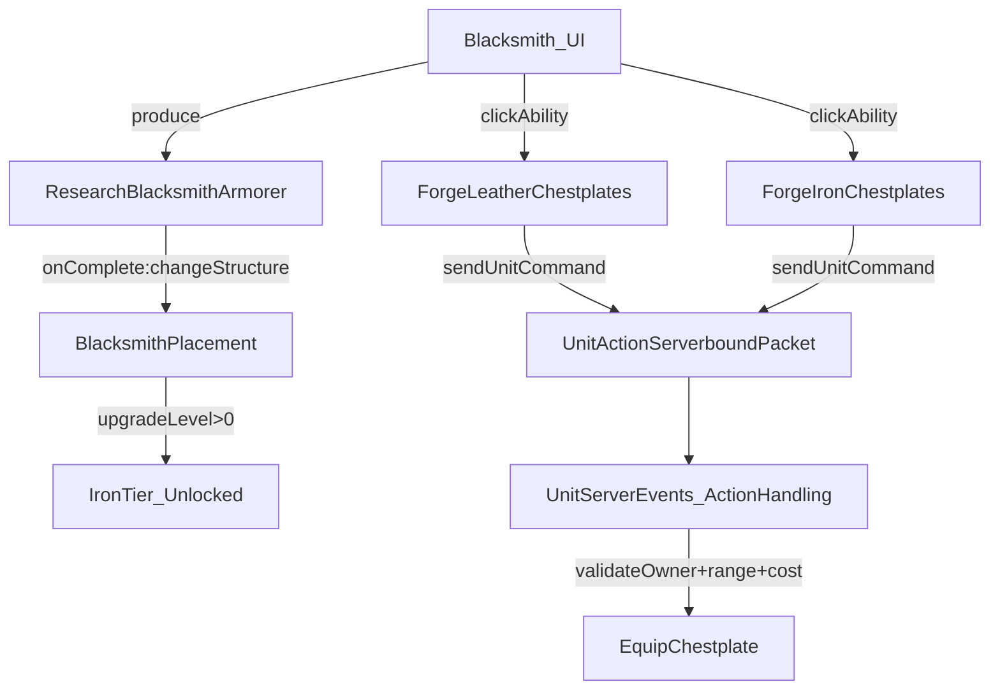

# Blacksmith Upgrade Plan

## Goal

Add the missing Blacksmith upgrade path per spec:

- 2 tiers: **Leather** (available immediately) and **Iron** (unlocked after an upgrade is researched)
- Upgrade research **changes the placed structure** (like Grand Library)
- Blacksmith gains an ore-cost **enchant-like ability** that applies to **currently selected units**

## Design (high-level)

## Implementation steps

### 1) Wire up the structure upgrade (research-driven)

- **Add** `Blacksmith.upgradedStructureName = "blacksmith_armorer"` in [`src/main/java/com/solegendary/reignofnether/building/buildings/villagers/Blacksmith.java`](src/main/java/com/solegendary/reignofnether/building/buildings/villagers/Blacksmith.java).
- **Mod-creator tip (important)**: new/upgraded structure NBTs must be placed in **two resource locations** (client + server). Follow the pattern used by other structures.\n+  - Add/ensure both copies exist for the upgraded Blacksmith:\n+    - `src/main/resources/assets/reignofnether/structures/blacksmith_armorer.nbt`\n+    - `src/main/resources/data/reignofnether/structures/blacksmith_armorer.nbt`\n+  - When the creator provides the final upgraded Blacksmith and Graveyard NBTs later, add them to **both** locations as well.
- **Add** `Blacksmith.getUpgradeLevel(BuildingPlacement placement)` similar to `Graveyard`/`Library`, based on a block type that’s guaranteed to exist in the upgraded structure (we’ll inspect `blacksmith_armorer.nbt` and choose a reliable “signature” block).
- **Create** a new research production item class:
- [`src/main/java/com/solegendary/reignofnether/research/researchItems/ResearchBlacksmithArmorer.java`](src/main/java/com/solegendary/reignofnether/research/researchItems/ResearchBlacksmithArmorer.java)
- Pattern-match `ResearchGrandLibrary` / `ResearchOverflowingGraveyard`:
    - `ProdDupeRule.DISALLOW_FOR_BUILDING`
    - `onComplete`: if placement is a blacksmith placement/building, call `placement.changeStructure(Blacksmith.upgradedStructureName)`
    - `getStartButton(...)` should disable when `prodBuilding.getUpgradeLevel() > 0`
- **Register** the new research item in [`src/main/java/com/solegendary/reignofnether/building/production/ProductionItems.java`](src/main/java/com/solegendary/reignofnether/building/production/ProductionItems.java).
- **Expose** it on the blacksmith production panel by adding it to `Blacksmith`’s `productions` list (pick a hotkey that doesn’t clash).
- **Mod-creator tip**: use [`src/main/java/com/solegendary/reignofnether/building/buildings/villagers/Library.java`](src/main/java/com/solegendary/reignofnether/building/buildings/villagers/Library.java) as the reference for how to declare building upgrades + building abilities.

### 2) Add 2-tier “forge chestplate” abilities (selected units)

- **Add new `UnitAction` values** in [`src/main/java/com/solegendary/reignofnether/unit/UnitAction.java`](src/main/java/com/solegendary/reignofnether/unit/UnitAction.java):
- `FORGE_LEATHER_CHESTPLATE`
- `FORGE_IRON_CHESTPLATE`
- **Mod-creator tip**: there currently aren’t any “equip abilities”; build this feature by cloning the Library’s enchant-ability approach (see `EnchantAbility` + `EnchantSharpness` etc). Concretely:\n+  - Keep the same pattern of server-authoritative validation, cost subtraction, cooldown feedback, and localized HUD error messages.\n+  - The key difference: instead of “click a unit to apply”, this one applies to **currently selected units**.
- **Create abilities** as building abilities (similar UX to other building buttons, but no per-unit clicking):
- New class(es) under [`src/main/java/com/solegendary/reignofnether/ability/abilities/`](src/main/java/com/solegendary/reignofnether/ability/abilities/), e.g. `ForgeLeatherChestplate.java` and `ForgeIronChestplate.java`.
- `AbilityButton.onLeftClick` should:
    - Grab selected unit entity IDs from `UnitClientEvents.getSelectedUnits()`
    - Send `UnitActionServerboundPacket` with `unitIds = selectedIds` and `selectedBuildingPos = blacksmith.originPos`
    - Do **client-side** quick validation (no units selected) and show a message.
- **Enable rules**:
    - Leather ability: enabled when a blacksmith is selected.
    - Iron ability: enabled only when `blacksmithPlacement.getUpgradeLevel() > 0`.
- **Hook ability execution on server** in the unit-action pipeline:
- Implement handling for these actions in [`src/main/java/com/solegendary/reignofnether/unit/UnitServerEvents.java`](src/main/java/com/solegendary/reignofnether/unit/UnitServerEvents.java) (where `addActionItem(...)` is consumed).
- Server logic:
    - Find the building via `selectedBuildingPos` and ensure it’s a blacksmith owned by the issuing player.
    - For each unit id in `unitIds`:
    - Validate it’s a `Unit` owned by same player.
    - Validate within range of the blacksmith (use the same range constant for both tiers; default 12 to match enchant UX).
    - Equip chestplate item:
        - Leather: equip `Items.LEATHER_CHESTPLATE` if chest slot is empty.
        - Iron: equip `Items.IRON_CHESTPLATE` if chest slot is empty **or** currently leather (do not overwrite better armor).
    - Charge ore **per successfully equipped unit**.
    - If not enough ore to cover all, apply to as many as affordable, then stop.

### 3) Costs + localization

- **Add resource cost entries** in [`src/main/java/com/solegendary/reignofnether/resources/ResourceCosts.java`](src/main/java/com/solegendary/reignofnether/resources/ResourceCosts.java):
- `RESEARCH_BLACKSMITH_ARMORER`
- `FORGE_LEATHER_CHESTPLATE`
- `FORGE_IRON_CHESTPLATE`
- **Expose in config** via [`src/main/java/com/solegendary/reignofnether/config/ReignOfNetherCommonConfigs.java`](src/main/java/com/solegendary/reignofnether/config/ReignOfNetherCommonConfigs.java) like other research/ability costs.
- **Add lang keys** in [`src/main/resources/assets/reignofnether/lang/en_us.json`](src/main/resources/assets/reignofnether/lang/en_us.json):
- Research name/tooltip
- Ability names/tooltips + common error strings (no selection, out of range, not enough ore)

### 4) Placeholder structure verification

- Confirm `blacksmith_armorer.nbt` loads and `BuildingBlockData.getBuildingBlocksFromNbt("blacksmith_armorer", ...)` yields blocks.\n+  - Verify both NBT locations exist (Step 1): `assets/.../structures` and `data/.../structures`.\n+- If the creator later supplies a new structure, swapping it is replacing the `.nbt` files in **both** locations; code should already reference the same structure name.

### 5) Sanity checks

- Verify:
- Research button appears in Blacksmith UI and upgrades the structure.
- Iron-tier ability remains disabled until upgrade.
- Abilities correctly charge ore per unit and only apply to owned, in-range units.
- No crashes on server/client when selection is empty.

## Files most likely touched

- [`src/main/java/com/solegendary/reignofnether/building/buildings/villagers/Blacksmith.java`](src/main/java/com/solegendary/reignofnether/building/buildings/villagers/Blacksmith.java)
- [`src/main/java/com/solegendary/reignofnether/research/researchItems/ResearchBlacksmithArmorer.java`](src/main/java/com/solegendary/reignofnether/research/researchItems/ResearchBlacksmithArmorer.java) (new)
- [`src/main/java/com/solegendary/reignofnether/building/production/ProductionItems.java`](src/main/java/com/solegendary/reignofnether/building/production/ProductionItems.java)
- [`src/main/java/com/solegendary/reignofnether/unit/UnitAction.java`](src/main/java/com/solegendary/reignofnether/unit/UnitAction.java)
- [`src/main/java/com/solegendary/reignofnether/ability/abilities/ForgeLeatherChestplate.java`](src/main/java/com/solegendary/reignofnether/ability/abilities/ForgeLeatherChestplate.java) (new)
- [`src/main/java/com/solegendary/reignofnether/ability/abilities/ForgeIronChestplate.java`](src/main/java/com/solegendary/reignofnether/ability/abilities/ForgeIronChestplate.java) (new)
- [`src/main/java/com/solegendary/reignofnether/unit/UnitServerEvents.java`](src/main/java/com/solegendary/reignofnether/unit/UnitServerEvents.java)
- [`src/main/java/com/solegendary/reignofnether/resources/ResourceCosts.java`](src/main/java/com/solegendary/reignofnether/resources/ResourceCosts.java)
- [`src/main/java/com/solegendary/reignofnether/config/ReignOfNetherCommonConfigs.java`](src/main/java/com/solegendary/reignofnether/config/ReignOfNetherCommonConfigs.java)
- [`src/main/resources/assets/reignofnether/lang/en_us.json`](src/main/resources/assets/reignofnether/lang/en_us.json)

## Implementation todos